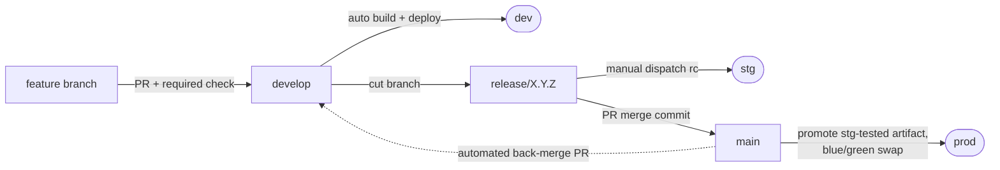

# Azure CI/CD Pipeline Template


[](https://github.com/avlon-technologies/template-azure-cicd/actions/workflows/on-pr.yml)
[](https://github.com/avlon-technologies/template-azure-cicd/actions/workflows/on-develop.yml)

A production-grade CI/CD pipeline template for **GitHub Actions → Azure App Service**, demonstrated with a minimal .NET 10 web API. Clone it, swap in your own application, and get environment promotion (dev → stg → prod), build-once-promote-many artifacts, blue/green production deploys, and secretless Azure authentication — without designing the pipeline yourself.

## Why this template exists

Most CI/CD examples stop at "build and deploy on push." Real delivery pipelines have to answer harder questions:

- How do I guarantee production runs **the exact binary** QA tested — not a rebuild of the same commit?
- How do I deploy to Azure **without storing cloud credentials** in GitHub?
- How do I know a deploy actually worked — and that the *right build* is serving?
- How do I roll back in seconds when a release goes wrong?
- How do hotfixes reach production without dragging in unreleased work?

This template answers all of them with plain GitHub Actions workflows you can read, adapt, and audit. The sample application is deliberately trivial (one greeting endpoint) — the pipeline is the product.

## Key features

- **Environment promotion** — dev (automatic on merge), stg (manually dispatched release candidates), prod (automatic on release merge), each mapped to its own Azure App Service and GitHub environment.
- **Build once, promote many** — release-candidate builds are stored as commit-keyed artifacts (90-day retention). Merging to `main` promotes the exact stg-tested binary; the pipeline **refuses to rebuild untested source for prod**, and **verifies the artifact's provenance** (which workflow run produced it, from which commit) before reusing or promoting it — an artifact merely *named* right is rejected.
- **Verified deploys** — every deploy ends with a smoke test that asserts both the health endpoint *and* that the app reports the intended build label (stamped into the assembly at build time, exposed via OpenAPI).
- **Blue/green production deploys** — the artifact lands in a staging slot, is smoke-tested there, then swapped into production. A failed post-swap smoke test automatically swaps the previous build back.
- **Secretless Azure auth** — OIDC workload identity federation with one scoped deploy identity per environment. There are no repository secrets at all.
- **Full release lifecycle** — gitflow-style release, hotfix, and support branches; automatic version detection from merge commits; immutable `build/<env>/<label>` audit tags; GitHub Releases; automated back-merge/backport PRs to `develop`.
- **Hardened workflows** — actions pinned to commit SHAs (Dependabot-maintained), least-privilege job permissions, injection-safe input handling, per-environment concurrency groups.

## How a change reaches production



1. Features merge to `develop` via PR (build + test is a required check) and deploy to **dev** automatically.
2. A release branch (`release/1.2.0`) is cut; pushes to it build only. A release coordinator dispatches the pipeline with an rc label (`1.2.0-rc.1`) to deploy to **stg**, which tags the commit `build/stg/1.2.0-rc.1` on success.
3. Merging the release PR to `main` (merge commit required) extracts the version, verifies a green staging deploy exists, promotes that exact artifact to **prod** via slot swap, tags `build/prod/1.2.0`, creates GitHub Release `v1.2.0`, and opens a back-merge PR to `develop`.

Hotfix (`hotfix/*`) and support (`support/*`) branches follow the same stg-then-prod path, cut from `main` instead of `develop`. Full operator procedures: [docs/operations-manual.md](docs/operations-manual.md).

## Repository structure

```
.
├── .github/
│   ├── workflows/
│   │   ├── _build.yml           # Reusable: build, test, publish, upload artifact, stamp build label
│   │   ├── _deploy.yml          # Reusable: OIDC login, deploy (optionally slot-swap), smoke test, tag
│   │   ├── _hotfix-support.yml  # Reusable: shared hotfix/support pipeline logic
│   │   ├── on-pr.yml            # PRs to develop/main → build + test (required check) + source-branch guard
│   │   ├── on-develop.yml       # develop → dev (automatic)
│   │   ├── on-release.yml       # release/**, milestone/** → stg (deploy is dispatch-gated)
│   │   ├── on-hotfix.yml        # hotfix/** → stg (deploy is dispatch-gated)
│   │   ├── on-support.yml       # support/** → stg (deploy is dispatch-gated)
│   │   ├── on-main.yml          # main → prod (artifact promotion, blue/green, release, back-merge)
│   │   └── show-oidc-token.yml  # Educational: inspect the OIDC JWT GitHub mints for a job
│   ├── scripts/                 # Shared bash sourced by workflows (artifact provenance check) + tests
│   ├── CODEOWNERS               # Pipeline changes require owner review
│   └── dependabot.yml           # Weekly NuGet + Actions SHA-pin updates
├── Api/                         # Sample .NET 10 minimal API (replace with your app)
├── Api.Test/                    # xUnit integration tests (WebApplicationFactory)
├── docs/                        # Guides, operations manual, C4 architecture docs
├── Directory.Build.props        # Shared build settings (net10.0, nullable)
└── cicd-demo.sln
```

## Documentation

| Document | What it covers |
|---|---|
| [docs/getting-started.md](docs/getting-started.md) | End-to-end setup: Azure resources, deploy identities, GitHub configuration, first deploy |
| [docs/customization.md](docs/customization.md) | Every file and value to change when adapting the template to your project |
| [docs/operations-manual.md](docs/operations-manual.md) | Day-to-day operations: releasing, hotfixing, rolling back, troubleshooting |
| [docs/workload-identity-federation.md](docs/workload-identity-federation.md) | How CI authenticates to Azure with no stored secrets |
| [docs/ARCHITECTURE.md](docs/ARCHITECTURE.md) | C4 architecture documentation (context → containers → components → code) |
| [CONTRIBUTING.md](CONTRIBUTING.md) | How to contribute to the template itself |
| [SECURITY.md](SECURITY.md) | Security model and vulnerability reporting |

## Prerequisites

**To run the sample app locally:**

- [.NET 10 SDK](https://dotnet.microsoft.com/download)

**To deploy your own instance:**

- An Azure subscription, with permission to create resource groups, App Services, user-assigned managed identities, and role assignments
- A GitHub repository (Actions enabled) where you have admin access — rulesets, environments, and Actions settings must be configured
- A machine to host the **self-hosted deploy runner** (deploy jobs run on it; builds stay on GitHub-hosted runners) — see [getting-started](docs/getting-started.md#self-hosted-deploy-runner)
- [Azure CLI](https://learn.microsoft.com/cli/azure/) (`az`) for identity setup; [GitHub CLI](https://cli.github.com/) (`gh`) is optional but used throughout the docs
- Provisioned Azure infrastructure — one App Service per environment (prod on a plan that supports deployment slots). The reference deployment provisions this with Terraform in the platform repo `avlon-technologies/infrastructure` (module `infra/modules/cicd-demo/`); any provisioning method works as long as the [required resources](docs/getting-started.md#step-2--provision-azure-resources) exist.

## Quick start (local)

```sh
git clone https://github.com/avlon-technologies/template-azure-cicd.git
cd template-azure-cicd
dotnet run --project Api
```

Then browse `http://localhost:5018/swagger` (the port comes from `Api/Properties/launchSettings.json`). Run the tests with:

```sh
dotnet test
```

## Quick start (deploy your own)

Condensed from [docs/getting-started.md](docs/getting-started.md), which has the full commands:

1. **Get the code** — use this repo as a template (or fork/clone) into your own GitHub repository, with `develop` as the default branch.
2. **Provision Azure** — per environment: a resource group and an App Service; prod additionally needs a `staging` deployment slot.
3. **Create deploy identities** — one user-assigned managed identity per environment with a federated credential trusting `repo:<owner>/<repo>:environment:<env>`, and the Website Contributor role scoped to that environment's resource group. See [workload identity federation](docs/workload-identity-federation.md).
4. **Configure GitHub** — create the `dev`, `stg`, `prod` environments and set the variables and settings below.
5. **Customize** — work through [docs/customization.md](docs/customization.md) (project names, resource-group names, smoke-test URLs).
6. **Deploy** — merge or push to `develop`; the pipeline builds, tests, deploys to dev, and smoke-tests the result.

## Required GitHub configuration

There are deliberately **no repository secrets** — Azure authentication is OIDC-based. Everything below is a variable or a setting.

### Repository variables

Settings → Secrets and variables → Actions → Variables:

| Variable | Value | Used by |
|---|---|---|
| `AZURE_TENANT_ID` | Your Entra ID tenant ID | `_deploy.yml` (Azure login) |
| `AZURE_SUBSCRIPTION_ID` | Your Azure subscription ID | `_deploy.yml` (Azure login) |

Tenant and subscription IDs are addressing information, not credentials — they are safe as plain variables (see [why](docs/workload-identity-federation.md#why-the-workflow-files-contain-no-secrets)).

### Environments and environment variables

Settings → Environments — create `dev`, `stg`, and `prod`, each with:

| Variable | Value |
|---|---|
| `AZURE_CLIENT_ID` | Client ID of that environment's deploy managed identity |
| `WEBAPP_NAME` | That environment's App Service name |
| `RESOURCE_GROUP` | That environment's resource-group name (used by the slot-swap steps) |
| `GATEWAY_URL` | *(optional)* URL the post-deploy smoke test uses instead of the app hostname (gateway-only ingress) |
| `DEPLOY_ALERT_WEBHOOK` | *(optional)* Chat webhook that failed deploys are pushed to |

The deploy job's `environment:` declaration scopes these variables, so the entry workflows carry no per-environment configuration. On `prod`, additionally configure **required reviewers** and a **deployment branch policy (`main` only)** — the human approval gate and branch restriction on production deploys are part of the security model, not optional hardening.

Deploy jobs run on a **self-hosted runner** (`runs-on: [self-hosted]` in `_deploy.yml`) so deploys egress from an IP the App Service deploy surfaces can allowlist — register one before your first deploy ([setup and hardening guidance](docs/getting-started.md#self-hosted-deploy-runner)). Build and PR jobs stay on GitHub-hosted runners.

### Repository settings

| Setting | Where | Value |
|---|---|---|
| Default branch | Settings → General | `develop` |
| Workflow permissions | Settings → Actions → General | Default token: **read-only** |
| Allow GitHub Actions to create and approve pull requests | Settings → Actions → General | **Enabled** (the back-merge/backport PRs need it) |
| Rulesets for `develop` and `main` | Settings → Rules | PR required; **build / Build & Test** check required; `main` additionally: merge commits only, **Guard main source branch** check required |

`main` must allow **merge commits only** — the prod pipeline reads the release version from the merge commit subject, and a squash or rebase merge breaks version detection *and* the back-merge.

## The workflows

Two reusable workflows (prefixed `_`) implement the mechanisms; branch-triggered entry workflows implement the policy:

| Workflow | Trigger | What it does |
|---|---|---|
| `on-pr.yml` | PRs to `develop`/`main` | Build + test (the required check); guards that PRs into `main` come from `release/*`, `hotfix/*`, or `support/*` |
| `on-develop.yml` | Push to `develop`; manual dispatch | Build, test, deploy to **dev**. Dispatch input `build-label` rebuilds HEAD stamped with a previous dev label (deploy retry) |
| `on-release.yml` | Push to `release/**`, `milestone/**`; manual dispatch | Pushes build only. Dispatch with a `version` (e.g. `1.2.0-rc.1`) builds a promotable artifact and deploys to **stg** |
| `on-hotfix.yml` / `on-support.yml` | Push to `hotfix/**` / `support/**`; manual dispatch | Same dispatch-gated stg pattern, for branches cut from `main` |
| `on-main.yml` | Push to `main`; manual dispatch | Promote the stg-tested artifact to **prod** (blue/green), tag, create the GitHub Release, open the back-merge PR. Dispatch input `version` redeploys/rolls back to any released version within artifact retention |
| `_build.yml` | Called | Restore, build (stamping the label into `InformationalVersion`), test (published as a PR check), publish, upload artifact |
| `_deploy.yml` | Called | Download artifact, OIDC login, deploy (direct or slot→smoke→swap), smoke-test, write run summary, tag the deployment. Runs on the self-hosted deploy runner; notifies `DEPLOY_ALERT_WEBHOOK` on failure if set |
| `show-oidc-token.yml` | Manual dispatch | Prints the decoded OIDC token claims for learning/debugging (minted with a non-Azure audience, so it can't be exchanged for access) |

Deploys to the same environment serialize via concurrency groups (`deploy-dev` / `deploy-stg` / `deploy-prod`); superseded PR builds are cancelled.

## Verification, rollback, and troubleshooting

- Every deploy smoke-tests `GET /v1/hello` **and** asserts `/openapi/v1.json` reports the deployed build label — "green" means the right build is actually serving.
- Every stg/prod deploy tags the built commit `build/<env>/<label>`; tags are immutable and are the promotion gate's proof that staging tested the build.
- **Instant prod rollback**: the previous production build stays in the staging slot after every swap — one `az webapp deployment slot swap` brings it back. Rollback to any older released version is a `workflow_dispatch` away.
- A comprehensive symptom → cause table lives in the [operations manual's troubleshooting section](docs/operations-manual.md#troubleshooting).

## Security considerations

- **No stored cloud credentials.** Deploys authenticate via [OIDC workload identity federation](docs/workload-identity-federation.md); tokens are job-scoped, short-lived, and bound to a specific repo + GitHub environment.
- **Blast-radius isolation.** Each environment has its own deploy identity with Website Contributor scoped to *only* its resource group — a compromised dev pipeline cannot touch prod.
- **Least-privilege tokens.** The default `GITHUB_TOKEN` is read-only; each job declares exactly the permissions it needs.
- **Supply-chain pinning.** All actions are pinned to full commit SHAs with a version comment, kept current by Dependabot.
- **Injection-safe workflows.** Workflow inputs reach shell scripts via `env:`, never by direct interpolation; version labels are charset-restricted because they become artifact names and git tags.
- **Deliberate demo trade-off:** Swagger UI and the OpenAPI document are enabled in *all* environments, including prod, because this sample API has no sensitive surface. Revisit this for a real application — see [customization](docs/customization.md).

## Azure resource naming

The reference deployment names resources `<type>-cicd-demo-<env>-cc` (e.g. `rg-cicd-demo-prod-cc`, `app-cicd-demo-prod-cc`, `asp-cicd-demo-prod-cc`) — resource-type prefix, project name, environment, region suffix, following the org's engineering-standards handbook. Nothing is hardcoded in the workflows: the names reach `_deploy.yml` only through each GitHub environment's `WEBAPP_NAME` and `RESOURCE_GROUP` variables — see [customization](docs/customization.md). The per-environment topology is described in [C2 — Containers](docs/c2-containers/README.md#deployment-topology-per-environment).

## Maintenance

- **Dependencies:** Dependabot ([config](.github/dependabot.yml)) opens weekly PRs for NuGet packages and Actions SHA pins. When bumping an action manually, update the SHA **and** its `# vX.Y.Z` comment together.
- **.NET upgrades:** update `Directory.Build.props` (`TargetFramework`), the `dotnet-version` in `_build.yml`, and package versions in the two `.csproj` files; the App Service runtime stack must match.
- **Template upgrades:** if you adopted this template, pull upstream workflow changes selectively — your customized values (names, URLs, smoke tests) live in the files listed in [customization](docs/customization.md), so diff those carefully.

## Contributing

Contributions are welcome — see [CONTRIBUTING.md](CONTRIBUTING.md) for the branch model, required checks, and workflow conventions (SHA-pinned actions, injection-safe inputs).

## License

This repository does not currently include a license file. Until one is added, the code is under default copyright — open an issue if you need clarity on reuse terms.
