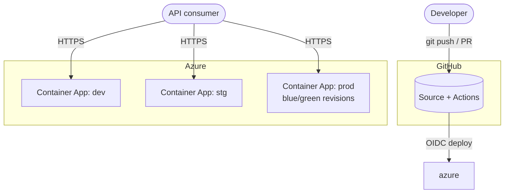

# Architecture

This document describes the architecture of **cicd-demo** using the [C4 model](https://c4model.com/): a set of hierarchical diagrams (Context, Containers, Components, Code) that zoom progressively from the system's place in the world down to individual code elements.

> **How to read this, and why it exists.** The intent is *spec-first*: these documents describe the system we want, at four levels of zoom, independent of any one implementation. In an ideal workflow the documentation and specification come first, and the implementation is generated from it. The current .NET / GitHub Actions / Azure implementation is one realization of this specification and is used throughout as a concrete example — but the architecture (an internet-facing, versioned HTTP API with a fully automated, environment-promoted, blue/green delivery pipeline) is the durable part. If the docs and the code disagree, that is a bug in one of them; treat this tree as the source of truth for *intent*.

## What the system is

A minimal, internet-facing HTTP API that returns a greeting, used as a reference implementation for a production-grade **CI/CD delivery pipeline**. The interesting architecture is not the application (one endpoint) — it is the **path to production**: how a commit becomes a verified, promoted, rolled-back-able release across three environments, with no long-lived secrets and a complete audit trail.

## The four levels

| Level | Question it answers | Folder |
|---|---|---|
| **C1 — Context** | Who and what uses the system, and what it depends on? | [`c1-context/`](c1-context/README.md) |
| **C2 — Containers** | What are the separately deployable/runnable pieces, and how do they communicate? | [`c2-containers/`](c2-containers/README.md) |
| **C3 — Components** | What are the major building blocks inside each container? | [`c3-components/`](c3-components/README.md) |
| **C4 — Code** | How are the key components implemented? | [`c4-code/`](c4-code/README.md) |

Each level is a self-contained document with a diagram, an element-by-element description, and the key architectural decisions made at that level of zoom.

## Architecture at a glance

## Cross-cutting principles

These hold at every level and are the "why" behind most decisions in the child documents:

- **Build once, promote many.** A binary is compiled exactly once and the *same bytes* move dev → stg → prod. Environments differ only by configuration, never by rebuild. See [C2](c2-containers/README.md) and [C3](c3-components/README.md).
- **Every deploy is verified.** No deploy reports success until a smoke test confirms the app answers correctly *and* is serving the exact build that was intended. See [C3 — Deploy pipeline](c3-components/README.md).
- **No long-lived secrets.** Azure authentication is OIDC workload-identity federation; there are no cloud credentials stored in the repo. See [C4 — Deploy identity](c4-code/README.md).
- **Immutable, auditable releases.** Deployment tags are immutable and record exactly what was tested and shipped. Promotion to prod is gated on proof of a green staging deploy.
- **Fast, safe rollback.** Production is blue/green: a bad build never receives user traffic, and the previous build is one traffic shift away.

## Related documents

- [`getting-started.md`](getting-started.md) — first-time setup: Azure resources, deploy identities, GitHub configuration.
- [`customization.md`](customization.md) — adapting the template to your own project.
- [`operations-manual.md`](operations-manual.md) — the operator's runbook: how to build, release, deploy, roll back, and troubleshoot.
- [`workload-identity-federation.md`](workload-identity-federation.md) — how CI authenticates to Azure without secrets.
- `CLAUDE.md` (repo root) — orientation for AI/automated contributors.
- The Azure runtime is provisioned by Terraform in the platform repo `avlon-technologies/infrastructure` (module `infra/modules/cicd-demo/`, environment roots `infra/environments/cicd-demo/{dev,stg,prod}/`) — not part of this repo.
