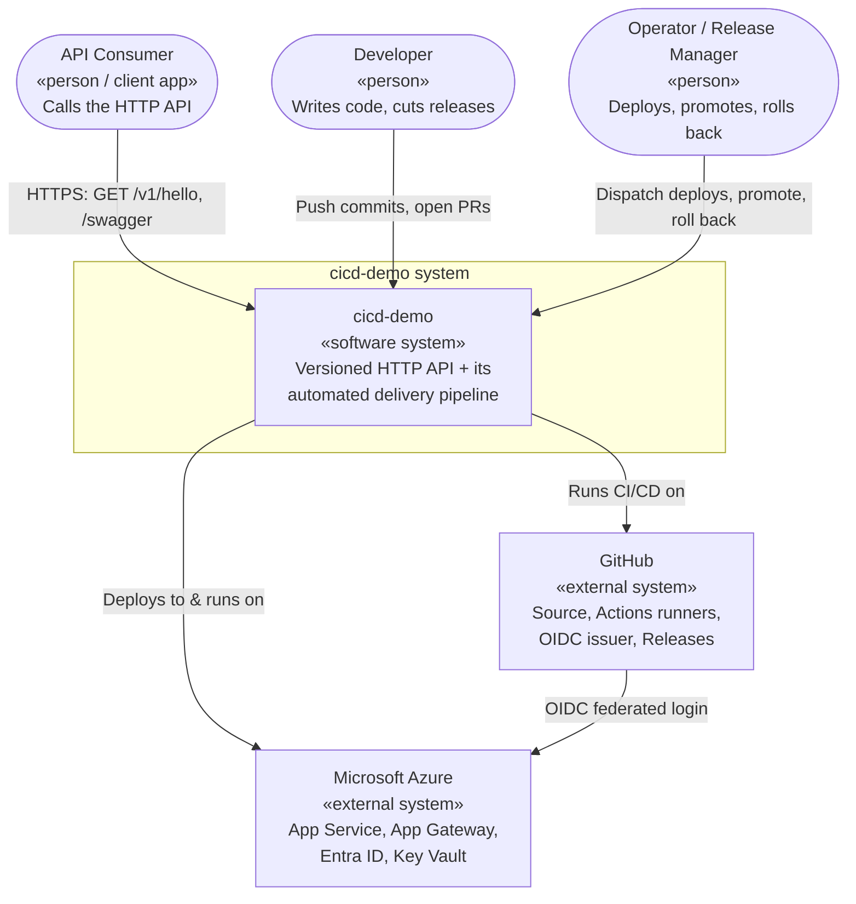

# C1 — System Context

The widest zoom: **cicd-demo** as a single box, the people and systems that interact with it, and the boundary that separates "our system" from "the world."

← [Back to Architecture overview](../ARCHITECTURE.md) · Next: [C2 — Containers](../c2-containers/README.md)

## Diagram

## People (actors)

| Actor | Role | Interactions |
|---|---|---|
| **API Consumer** | Any HTTP client — a browser, a downstream service, a smoke-test script. | Calls `GET /v1/hello` for the greeting; browses `/swagger` for interactive docs; the platform health probe calls `/healthz`. |
| **Developer** | Writes application code and tests. | Pushes to feature branches, opens PRs to `develop`/`main`. Never deploys to prod directly — features reach production only through a release. |
| **Operator / Release Manager** | Owns the path to production. | Cuts release/hotfix/support branches, dispatches staging deploys, merges release PRs (which auto-promote to prod), and performs rollbacks. Often the same person as the developer in a small team, but a distinct *role*. |

## External systems (dependencies)

| System | What we use it for | Why it's a dependency, not part of our system |
|---|---|---|
| **GitHub** | Source control, pull requests + branch rulesets (the quality gates), Actions (CI/CD compute), the OIDC token issuer for cloud auth, and GitHub Releases. | We consume it as a platform; we configure it but don't operate it. |
| **Microsoft Azure** | The runtime: App Service hosts the API, a shared Application Gateway fronts all environments, Entra ID (via App Registrations + federated credentials) authorizes deploys, Key Vault holds any per-environment secrets. | Managed cloud services; provisioned by Terraform in a separate repo, not built by us. |

## System boundary — what's in, what's out

**Inside the boundary** (this repo owns and specifies it):
- The API application and its tests.
- The CI/CD pipeline (build, test, publish, deploy, promote, tag, release, back-merge).
- The contract each deploy must satisfy (smoke test + version assertion).

**Outside the boundary** (depended upon, specified elsewhere):
- The Azure runtime topology — resource groups, VNets, App Services, slots, the App Gateway, Key Vaults, and deploy identities — is provisioned by Terraform in **`../cicd-infrastructure`**. Deploys fail until that infrastructure exists for the target environment.
- GitHub repository settings (rulesets, workflow permissions, environment variables) — configured in the GitHub UI, documented in the [operations manual](../operations-manual.md), not code in this repo.

## Environments

The single system is realized as **three isolated environments**, each a full copy of the runtime, differing only by configuration:

| Environment | Purpose | How code arrives |
|---|---|---|
| **dev** | Continuous integration target; latest `develop`. | Automatic on merge/push to `develop`. |
| **stg** | Release-candidate verification (QA/UAT). | Manual dispatch of a release/hotfix/support pipeline. |
| **prod** | Live, user-facing. | Automatic on merge to `main`, via blue/green promotion of the stg-tested binary. |

Environment isolation (separate resource groups, separate deploy identities scoped to their own resource group only) is a **security boundary**: a compromise of the dev deploy path cannot touch prod.

## Key decisions at this level

- **The pipeline is part of the system, not scaffolding around it.** The reference value of this project is the delivery mechanism, so it lives inside the boundary and is specified with the same rigor as the app.
- **Three-environment promotion model.** dev (integration) → stg (verification) → prod (live) with progressively stricter gates. Prevents untested code from reaching users while keeping dev fast.
- **GitHub and Azure are federated, not secret-coupled.** GitHub issues short-lived OIDC tokens that Azure trusts; there is no shared secret between the two external systems. This is a deliberate context-level choice that shapes every deploy interaction below.
