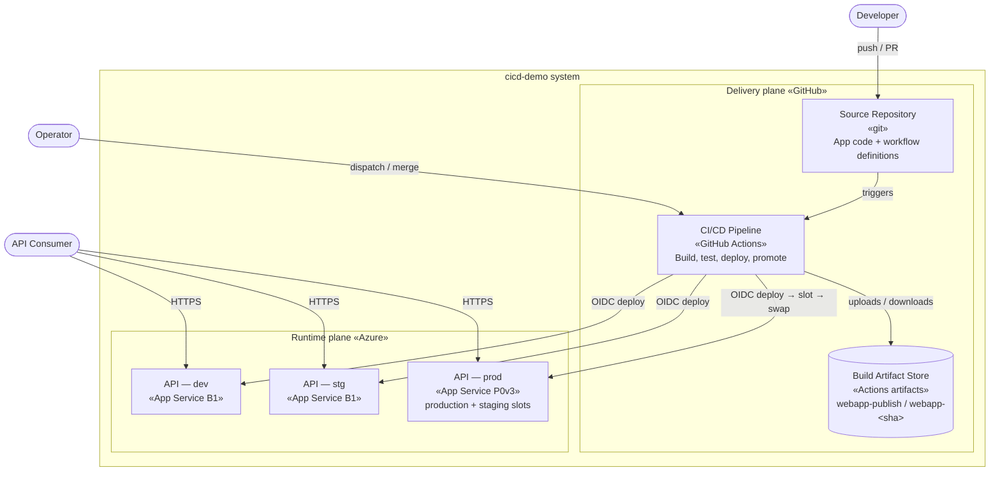
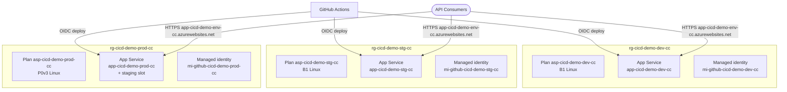

# C2 — Containers

Zooming into the system boundary: the separately deployable / runnable / configurable units ("containers" in C4 terms — not Docker containers) and how they communicate. A container is something that runs as its own process or is deployed independently.

← [C1 — Context](../c1-context/README.md) · [Architecture overview](../ARCHITECTURE.md) · Next: [C3 — Components](../c3-components/README.md)

## Diagram

The system splits into two **planes**: a **delivery plane** (how code becomes a running deployment) and a **runtime plane** (what actually serves traffic). Most of the architecture's substance is in the delivery plane.

## Containers

### Delivery plane (GitHub)

| Container | Technology | Responsibility |
|---|---|---|
| **Source Repository** | Git on GitHub | Holds the application code, tests, and the workflow definitions that *are* the pipeline. Branch rulesets enforce PR-only merges and required checks — the quality gate lives here. |
| **CI/CD Pipeline** | GitHub Actions (reusable + entry workflows) | Builds, tests, publishes, deploys, promotes, tags, releases, and back-merges. Decomposed in [C3](../c3-components/README.md). |
| **Build Artifact Store** | GitHub Actions artifacts | Holds compiled publish output. Two naming schemes: `webapp-publish` (ephemeral, 1-day) for throwaway builds, and `webapp-<sha>` (90-day) for promotable release candidates. **This store is what makes "build once, promote many" possible** — prod pulls the exact bytes stg tested. |

### Runtime plane (Azure)

| Container | Technology | Responsibility |
|---|---|---|
| **API — dev / stg** | Azure App Service (B1 Linux) | Runs the published API. One App Service per environment, in its own resource group, served directly at `https://app-cicd-demo-<env>-cc.azurewebsites.net`. |
| **API — prod** | Azure App Service (P0v3, with slots) | Same API, but on a plan that supports deployment **slots** — a `staging` slot and a `production` slot — enabling blue/green deploys and instant rollback. |

The **API application itself is a single container** — one self-hosted Kestrel process per App Service. Its internal structure is the subject of [C3](../c3-components/README.md).

## Communication

| From → To | Protocol | Notes |
|---|---|---|
| Consumer → App Service | HTTPS | Public traffic, directly to each environment's `https://app-cicd-demo-<env>-cc.azurewebsites.net`. |
| Pipeline → App Service | Azure REST (via `azure/webapps-deploy`, `az`) | Authenticated by short-lived OIDC token, not a stored secret. Deploy jobs egress from a **self-hosted runner** so the App Service deploy surfaces can IP-allowlist them; smoke tests use the environment's `GATEWAY_URL` when its main site only admits a gateway. |
| Pipeline → Artifact Store | Actions artifact up/download (REST for cross-run) | Cross-run download (promotion) needs `actions: read`. |
| Repository → Pipeline | GitHub event triggers | Push, PR, and `workflow_dispatch`. |

## Deployment topology per environment

Each environment is a self-contained stamp: its own resource group `rg-cicd-demo-<env>-cc` containing an App Service plan `asp-cicd-demo-<env>-cc` (Linux; B1 for dev/stg, P0v3 for prod), an App Service `app-cicd-demo-<env>-cc` (.NET 10; prod additionally has a `staging` deployment slot — the blue/green swap target), and its own deploy identity (a user-assigned managed identity `mi-github-cicd-demo-<env>-cc` scoped to *only* that resource group). Nothing is shared between environments; each app is reached directly at its `azurewebsites.net` URL (or through the platform gateway where the allowlisted-ingress deployment mode is used — the environment's `GATEWAY_URL` variable records it).

## Key decisions at this level

- **Delivery plane and runtime plane are separate systems, federated by OIDC.** GitHub compute never holds an Azure credential; it presents a signed identity token that Azure's per-environment trust configuration accepts. Removes the single largest class of CI secrets.
- **The artifact store is a first-class container, not an implementation detail.** Making the compiled binary a durable, addressable object (keyed by commit SHA, retained 90 days) is what lets prod promote the *exact* stg-tested bytes instead of rebuilding from source. Rebuilding would reintroduce the risk the whole verification chain exists to remove.
- **Prod is the only environment with slots.** Blue/green is bought at the cost of a pricier plan (P0v3 vs B1). dev/stg roll back by re-running a workflow; prod rolls back by a near-instant slot swap. The cost is spent only where user-facing downtime matters.
- **Isolated stamps; ingress is deployment-mode dependent.** Separate resource groups + scoped identities keep the environments' blast radius independent. By default each App Service is exposed directly at its `azurewebsites.net` URL; where the platform fronts the app with a gateway/IP allowlist, consumer traffic enters via the gateway and the environment's `GATEWAY_URL` variable points the pipeline's smoke tests at it.
- **Deploys egress from privileged, self-hosted compute.** The deploy job runs on a self-hosted runner (allowlisted at the App Service deploy surfaces) — it is part of the delivery plane's trusted computing base and is hardened accordingly (dedicated to this repo, ephemeral where possible; see [getting-started](../getting-started.md#self-hosted-deploy-runner)). Build jobs stay on GitHub-hosted runners.
