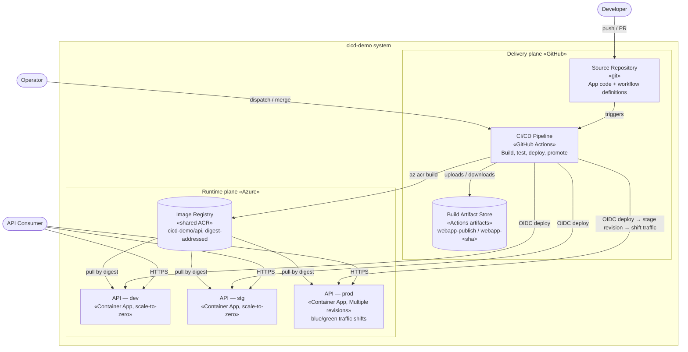
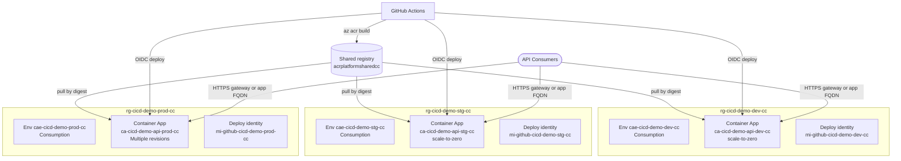

# C2 — Containers

Zooming into the system boundary: the separately deployable / runnable / configurable units ("containers" in C4 terms — not Docker containers) and how they communicate. A container is something that runs as its own process or is deployed independently.

← [C1 — Context](../c1-context/README.md) · [Architecture overview](../ARCHITECTURE.md) · Next: [C3 — Components](../c3-components/README.md)

## Diagram

The system splits into two **planes**: a **delivery plane** (how code becomes a running deployment) and a **runtime plane** (what actually serves traffic). Most of the architecture's substance is in the delivery plane.

## Containers

### Delivery plane (GitHub)

| Container | Technology | Responsibility |
|---|---|---|
| **Source Repository** | Git on GitHub | Holds the application code, tests, and the workflow definitions that *are* the pipeline. Branch rulesets enforce PR-only merges and required checks — the quality gate lives here. |
| **CI/CD Pipeline** | GitHub Actions (reusable + entry workflows) | Builds, tests, publishes, deploys, promotes, tags, releases, and back-merges. Decomposed in [C3](../c3-components/README.md). |
| **Build Artifact Store** | GitHub Actions artifacts | Holds compiled publish output plus the marker artifacts (`.label.<label>`, `.image.<digest-hex>`) that record what a run built. Two naming schemes: `webapp-publish` (ephemeral, 1-day) for throwaway builds, and `webapp-<sha>` (90-day) for promotable release candidates. Together with the digest-addressed registry, **this is what makes "build once, promote many" possible** — prod pins the exact image digest stg tested. |

### Runtime plane (Azure)

| Container | Technology | Responsibility |
|---|---|---|
| **Image Registry** | Shared Azure Container Registry (`acrplatformsharedcc`) | Holds `cicd-demo/api` images, built cloud-side by `az acr build` from the tested publish output. Content-addressed: every deploy pins an immutable digest, so registry access can never substitute bytes under a promoted digest. |
| **API — dev / stg** | Azure Container Apps (Consumption, scale-to-zero, `Single` revision mode) | Runs the API image. One Container App per environment (`ca-cicd-demo-api-<env>-cc`) in its own resource group; `min_replicas = 0`, so idle environments cost nothing and the first request cold-starts a replica. |
| **API — prod** | Azure Container Apps (Consumption, `Multiple` revision mode) | Same image, but with revision-based **blue/green**: the pipeline stages each release as a zero-traffic revision, smoke tests it on its own FQDN, then shifts traffic — and shifts back on a failed post-shift check. The previous revision stays active at 0% for instant rollback. |

The **API application is one container image** — a runtime-only image (`Dockerfile` at the repo root) wrapping the published Kestrel process. Its internal structure is the subject of [C3](../c3-components/README.md).

## Communication

| From → To | Protocol | Notes |
|---|---|---|
| Consumer → Container App | HTTPS | Via the platform gateway (`GATEWAY_URL`) where the allowlisted-ingress mode is on, else directly at the app's Container Apps FQDN. |
| Pipeline → Registry | `az acr build` (ACR Tasks, control-plane) | The image builds cloud-side — no Docker on any runner; the app pulls with its own identity (AcrPull). |
| Pipeline → Container App | Azure REST (`az containerapp`) | Authenticated by short-lived OIDC token, not a stored secret. Deploys are control-plane, but the smoke tests must reach the app's single, IP-allowlisted ingress — so deploy jobs egress from the **self-hosted runner**; post-deploy tests use the environment's `GATEWAY_URL` when only the gateway is admitted. |
| Pipeline → Artifact Store | Actions artifact up/download (REST for cross-run) | Cross-run download (promotion) needs `actions: read`. |
| Repository → Pipeline | GitHub event triggers | Push, PR, and `workflow_dispatch`. |

## Deployment topology per environment

Each environment is a self-contained stamp: its own resource group `rg-cicd-demo-<env>-cc` containing a Consumption-only Container Apps environment `cae-cicd-demo-<env>-cc` (with a Log Analytics workspace for container logs), the API as a scale-to-zero Container App `ca-cicd-demo-api-<env>-cc` (prod in `Multiple` revision mode — the blue/green mechanism), the app's pull identity `mi-cicd-demo-<env>-cc` (AcrPull), and its deploy identity (`mi-github-cicd-demo-<env>-cc`, Container Apps Contributor scoped to *only* that resource group, plus build/pull roles on the shared registry). Only the image registry is shared between environments — and it is content-addressed, so sharing it cannot blur which bytes an environment runs. Consumers reach each app through the platform gateway (`GATEWAY_URL`) or directly at its Container Apps FQDN.

## Key decisions at this level

- **Delivery plane and runtime plane are separate systems, federated by OIDC.** GitHub compute never holds an Azure credential; it presents a signed identity token that Azure's per-environment trust configuration accepts. Removes the single largest class of CI secrets.
- **The artifact store and registry are first-class containers, not implementation details.** The compiled output is a durable, addressable object (commit-keyed artifact, 90 days) packaged once into a content-addressed image whose digest every deploy pins — prod promotes the *exact* stg-tested bytes instead of rebuilding from source. Rebuilding would reintroduce the risk the whole verification chain exists to remove.
- **Prod is the only environment with Multiple revision mode.** Blue/green costs nothing extra on Consumption compute — the previous revision idles at zero traffic and zero replicas. dev/stg roll back by re-running a workflow; prod rolls back by a near-instant traffic shift.
- **Compute scales to zero (infra ADR-0008).** Idle environments bill nothing; the accepted cost is a cold start (seconds to tens of seconds) on the first request after idle, which the pipeline's smoke-test loops absorb.
- **Isolated stamps; ingress is deployment-mode dependent.** Separate resource groups + scoped identities keep the environments' blast radius independent. A Container App has a single ingress surface with one IP-restriction list; where the platform fronts the app with the gateway, consumer traffic enters via the gateway and the environment's `GATEWAY_URL` variable points the pipeline's smoke tests at it.
- **Deploys egress from privileged, self-hosted compute.** The deploy job runs on a self-hosted runner (on the apps' ingress allowlist — deploys themselves are control-plane, but the smoke tests aren't) — it is part of the delivery plane's trusted computing base and is hardened accordingly (ephemeral Container Apps job, org runner group; see [getting-started](../getting-started.md#self-hosted-deploy-runner)). Build and image jobs stay on GitHub-hosted runners.
