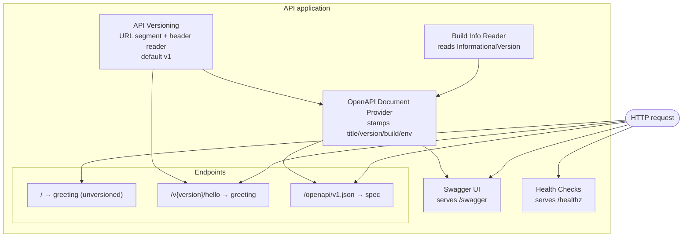
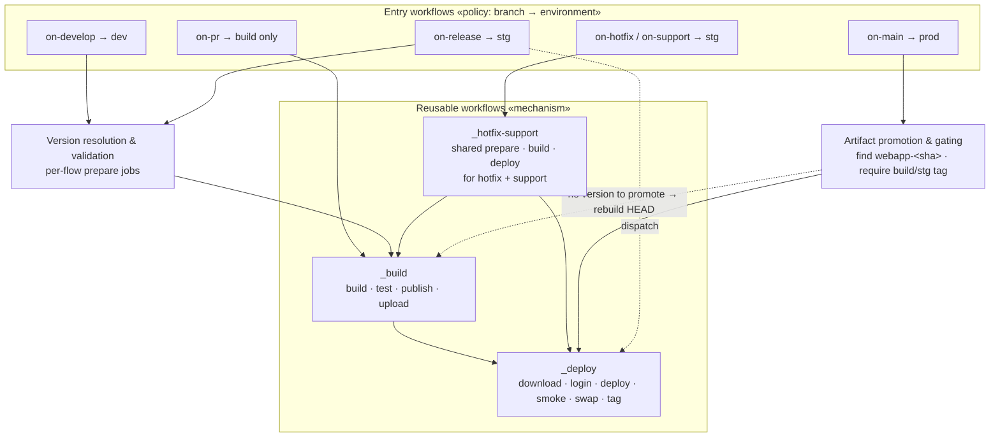
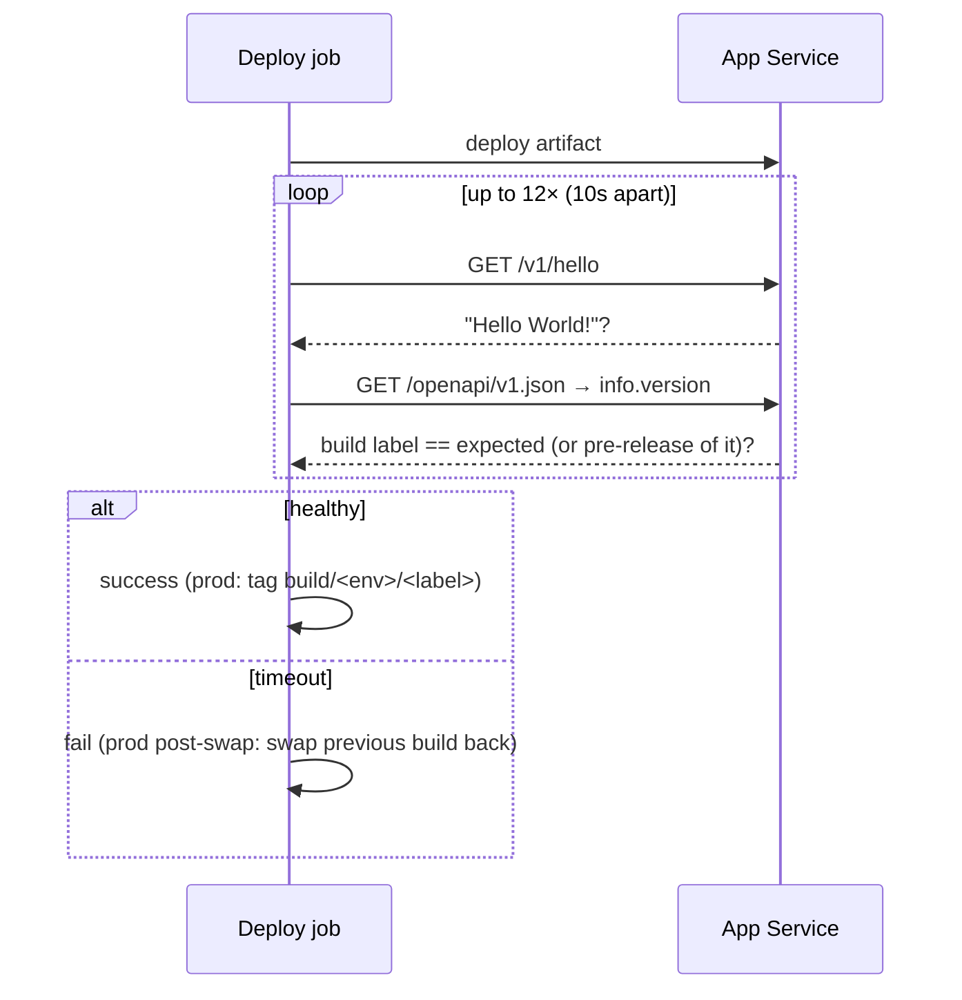

# C3 — Components

Zooming inside the two containers with meaningful internal structure: the **API application** and the **CI/CD pipeline**. A component is a grouping of related functionality behind a clear responsibility — not necessarily a separate file, but a distinct role.

← [C2 — Containers](../c2-containers/README.md) · [Architecture overview](../ARCHITECTURE.md) · Next: [C4 — Code](../c4-code/README.md)

---

## Part A — The API application

A single self-hosted ASP.NET Core (minimal API) process. Its components are the middleware/services configured at startup and the endpoints they expose.

### Diagram

### Components

| Component | Responsibility | Why it exists |
|---|---|---|
| **Build Info Reader** | On startup, reads the assembly's `InformationalVersion`, splits it into the build **label** and the **commit SHA** (the SDK appends `+<sha>`). | The running build must be self-identifying. The pipeline's smoke test asserts against exactly this value — it is the contract between app and pipeline. |
| **API Versioning** | Routes `/v{version}/…`, defaults to v1, also reads an `api-version` header, and reports supported versions. | Breaking changes ship as a *new* version served from the same deployment; old versions keep answering. The versioning scheme is an architectural commitment, not an afterthought. |
| **OpenAPI Document Provider** | Generates `/openapi/v1.json`, stamping the document title, the build label as the spec `version`, a commit-linked description, and the environment name. | Makes the deployed build **observable over HTTP** — both humans (Swagger) and machines (the smoke test's `jq '.info.version'`) read it. |
| **Swagger UI** | Serves interactive docs at `/swagger` from the OpenAPI document. | Human-facing verification surface; enabled in *every* environment including prod (this API has no sensitive surface). |
| **Health Checks** | Serves `/healthz` as a dedicated liveness probe, decoupled from the greeting. | The gateway/platform probe needs a stable endpoint independent of business responses; dependency checks (Key Vault, etc.) register here and surface as Degraded/Unhealthy. |
| **Endpoints** | `/` (unversioned greeting), `/v1/hello` (versioned greeting), `/openapi/v1.json`, `/healthz`, `/swagger`. | The actual surface area. `/v1/hello` is the canonical smoke-test target. |

### The app↔pipeline contract

The two containers meet at one invariant: **the build label the pipeline intends to deploy must equal the `info.version` the running app reports** (or a pre-release of it). The Build Info Reader and OpenAPI Provider produce that value; the [Deploy pipeline](#part-b--the-cicd-pipeline) asserts it. This single contract is what turns "the deploy succeeded" into "the *right build* is actually serving."

---

## Part B — The CI/CD pipeline

Decomposed into **reusable workflows** (the mechanisms, prefixed `_`) composed by **entry workflows** (the branch-triggered policies). There are three reusable workflows: `_build.yml` and `_deploy.yml` (used directly by most flows) and `_hotfix-support.yml`, a shared mechanism that wraps the prepare→build→deploy sequence for the two near-identical hotfix and support flows.

### Diagram

`on-hotfix.yml` and `on-support.yml` are thin wrappers: they forward the trigger context (branch type, ref, sha, run number) into `_hotfix-support.yml`, which holds their prepare→build→deploy logic. The prepare stages for the other flows (`on-develop`, `on-release`, `on-main`) live in the entry workflows themselves.

### Components

| Component | Lives in | Responsibility |
|---|---|---|
| **Build & Test** | `_build.yml` | Restore, build (stamping the build label into `InformationalVersion`), test (publishing results as a PR check), publish, and upload the artifact. Emits the resolved `build-label`. Fails the run if any test fails. |
| **Deploy** | `_deploy.yml` | Download the artifact, OIDC-login to Azure, deploy (direct, or slot→smoke→swap for prod), **smoke-test** (`/v1/hello` + version assertion), print the run-summary card, and tag the deployed commit. Auto-swaps back on a failed post-swap smoke test. |
| **Hotfix/support pipeline** | `_hotfix-support.yml` | Shared prepare→build→deploy mechanism for the two near-identical hotfix and support flows. Called by the thin `on-hotfix.yml` / `on-support.yml` wrappers, which pass it the branch type and trigger context so one definition serves both. |
| **Version resolution & validation** | `prepare` jobs in the entry workflows (`on-develop`, `on-release`, `on-main`) and in the shared `_hotfix-support.yml` (hotfix/support) | Turn a branch + optional input into a build label, and reject labels that don't match the branch (e.g. `1.2.0-rc.1` from `release/1.3.0`). Keeps staging from ever being stamped with a version that doesn't belong to its branch. |
| **Artifact promotion & gating** | `on-main.yml` + `_deploy.yml` inputs | On merge to `main`, locate the `webapp-<sha>` artifact for the release head, **require a `build/stg/*` tag** (proof of a green staging deploy), and deploy *that binary* with the build job skipped. Missing artifact or missing tag → the prod run fails rather than rebuilding untested source. |
| **Branch policy** | entry workflows (`on-*.yml`) | Map trigger branch → environment, wire concurrency groups (serialize deploys per env), and set the correct permissions/flags. This is where "develop is auto-deployed but release is dispatch-gated" is decided. |
| **Release finalization** | `on-main.yml` release job | After a prod deploy: create the GitHub Release `vX.Y.Z` and open a back-merge PR to `develop` so stabilization fixes aren't lost. |

### Branch → environment mapping

| Entry workflow | Branches | Environment | Deploy trigger |
|---|---|---|---|
| `on-pr.yml` | PRs to `develop`/`main` | — (build/test only) | the required check |
| `on-develop.yml` | `develop` | dev | automatic on push |
| `on-release.yml` | `release/**`, `milestone/**` | stg | push builds; **deploy dispatch-gated** |
| `on-hotfix.yml` / `on-support.yml` | `hotfix/**` / `support/**` | stg | push builds; **deploy dispatch-gated** |
| `on-main.yml` | `main` | prod | automatic on merge (blue/green) |

### The deploy pipeline's verification contract

Every deploy — dev, stg, and prod — ends the same way:

A mismatch is treated as "not ready yet" (the old build may still be warming down) and only fails on timeout — which also cleanly handles the blue/green warm-up window.

## Key decisions at this level

- **Mechanism vs. policy split.** `_build`/`_deploy` know *how*; `on-*` workflows know *when/where*. New branch flows reuse the mechanisms without duplicating deploy logic, and the deploy contract (smoke test, tagging, swap-back) is defined once.
- **Version identity is threaded end-to-end.** The label is chosen at build, compiled into the binary, asserted at deploy, and written as an immutable tag. There is no point in the pipeline where "which build is this?" is ambiguous.
- **Promotion is gated on proof, not trust.** Prod won't ship a binary unless a `build/stg/*` tag proves it went green on staging. "Stg-tested" is a verified fact recorded in git, not an assumption.
- **Blue/green + auto-swap-back is a component responsibility, not an operator's.** The pipeline itself restores the previous prod build on a failed post-swap smoke test; recovery doesn't wait for a human.
