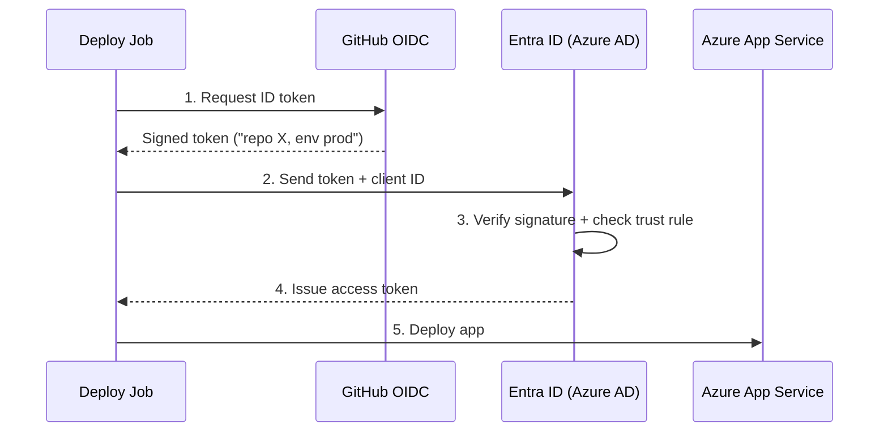

# Workload Identity Federation

This repo's pipelines deploy to Azure App Service without any stored credential — no client secret, no certificate. Instead, they use **workload identity federation** (GitHub OIDC): GitHub mints a signed JWT asserting the identity of each job, and Entra ID validates it against a pre-configured trust rule before issuing a short-lived access token.

## Why not a client secret

A client secret works but creates a standing credential: it can be used from anywhere until it expires, it needs rotation, and it must be stored in every system that needs to deploy. A job-scoped OIDC token eliminates all three: it's minted per job, valid for ~5 minutes, never stored, and bound to a specific repo and GitHub environment by its claims.

## How it works



1. **Request ID token** — the job requests an OIDC JWT from GitHub's token endpoint (`$ACTIONS_ID_TOKEN_REQUEST_URL`). The token is RS256-signed with GitHub's private key and contains claims describing the job context: repo, branch, workflow, environment, commit SHA, run ID, etc.

2. **Token exchange** — the job POSTs the JWT and the app registration's client ID to Entra ID's token endpoint. No secret is required because the JWT is the proof of identity.

3. **Validation** — Entra ID fetches GitHub's JWKS endpoint to verify the signature, checks that the token is unexpired, and matches the `sub` claim against the **federated credential** configured on the app registration.

4. **Access token** — if validation passes, Entra ID returns a short-lived access token scoped to the RBAC roles assigned to the app registration.

5. **Deployment** — the job uses the access token to call Azure's management APIs and deploy the app.

## Where each piece lives

| Piece | What it is | Where |
|---|---|---|
| Token request | Authorizes the job to request an ID token | `permissions: id-token: write` in the caller workflows |
| Token subject | Determines the `sub` claim (includes the GitHub environment) | `environment: <env>` on the deploy job in `_deploy.yml` |
| Identity | The service principal the job authenticates as | App registrations `demo-helloworld-github-deploy-{dev,stg,prod}` in Entra ID |
| Trust rule | Which JWTs Entra ID will accept | A federated credential on each app registration, matching one repo + environment |
| Permissions | What the identity may do | RBAC role (Website Contributor) scoped to that environment's resource group |
| Addressing | Which identity/tenant/subscription to target | `AZURE_CLIENT_ID` environment variable + `AZURE_TENANT_ID` / `AZURE_SUBSCRIPTION_ID` repo variables |

Each environment has its own app registration scoped to its own resource group — a dev deploy cannot affect prod resources.

## The federated credential

Each app registration carries a single federated credential. This is the one on the prod identity:

```json
{
  "name": "github-cicd-demo-prod",
  "issuer": "https://token.actions.githubusercontent.com",
  "subject": "repo:pixelbits-mk/cicd-demo:environment:prod",
  "audiences": ["api://AzureADTokenExchange"]
}
```

Entra ID accepts a token only if all three fields match:

- **`issuer`** — must be GitHub Actions' OIDC provider, which is also the JWKS source for signature verification.
- **`subject`** — matched as a literal string against the JWT's `sub` claim. A token from a fork, a different repo, or a job not assigned to the `prod` GitHub environment produces a different `sub` and is rejected.
- **`audiences`** — must be Azure's token exchange endpoint (`api://AzureADTokenExchange`), preventing token replay from other services.

To inspect or manage federated credentials:

- **Portal:** Entra ID → App registrations → `demo-helloworld-github-deploy-<env>` → **Certificates & secrets** → **Federated credentials**
- **CLI:** `az ad app federated-credential list --id <client-id>`

GitHub mints and signs tokens for every workflow automatically. Entra ID trusts none of them unless a federated credential explicitly opts in — that narrow match is where the security boundary lives.

## Why the workflow files contain no secrets

The workflow files expose the client ID, tenant ID, and subscription ID in plain text. None are sensitive:

- The **client ID** identifies the app registration but cannot authenticate without a valid GitHub-signed JWT with a matching `sub`.
- The **tenant and subscription IDs** are addressing information, not credentials.

The JWT is never stored: it's minted per job, used once for token exchange, and GitHub auto-masks it in logs. Even if intercepted, the token expires in ~5 minutes, and replaying it from outside the original job context produces a `sub` mismatch. A successful login is additionally constrained to one resource group by RBAC.

## Inspecting a live token

Run the **Show OIDC Token Claims** workflow (Actions → Show OIDC Token Claims → Run workflow). It decodes and prints the JWT header and claims, and uploads the raw token as an artifact for inspection at [jwt.io](https://jwt.io). The token is minted with a non-Azure audience so it cannot be exchanged for an Azure access token.
